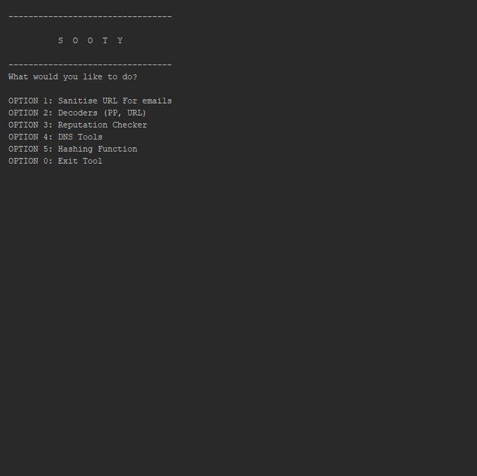
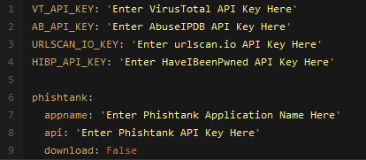
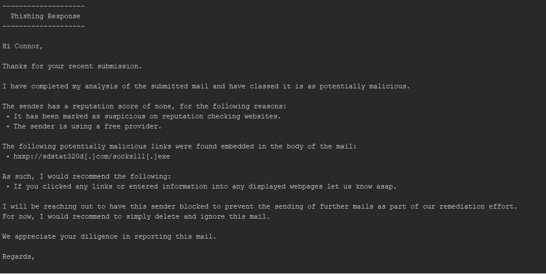
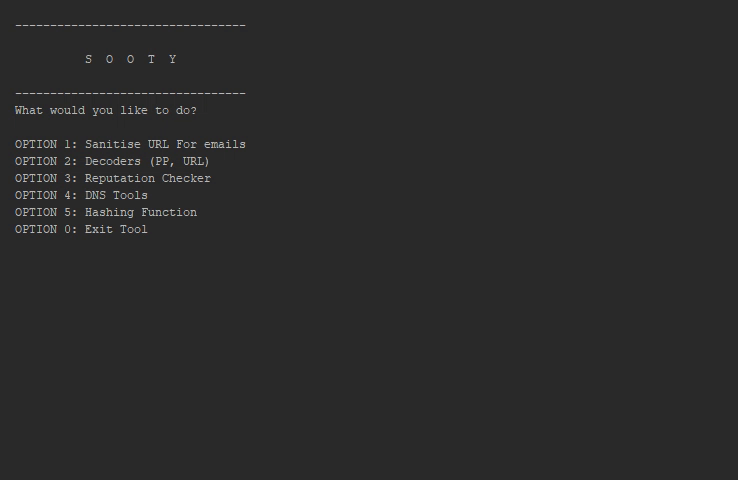

[](https://GitHub.com/theresafewconors/sooty)
[](https://GitHub.com/theresafewconors/sooty)
[](https://GitHub.com/theresafewconors/sooty/graphs/contributors/)
[](https://GitHub.com/theresafewconors/sooty)
[](https://GitHub.com/theresafewconors/sooty)


[](https://tines.io?utm_source=github&utm_medium=sponsorship&utm_campaign=sooty)
# Overview

Sooty is a tool developed with the task of aiding SOC analysts with automating part of their workflow. One of the goals of Sooty is to perform as much of the routines checks as possible, allowing the analyst more time to spend on deeper analysis within the same time-frame. Details for many of Sooty's feature can be found below.

Sooty is now proudly supported by [Tines.io](https://tines.io?utm_source=github&utm_medium=sponsorship&utm_campaign=sooty)! The SOAR Platform for Enterprise Security Teams.

## Contents
 - [Current Features](#sooty-can-currently)
 - [Requirements & Installation](#requirements-and-installation)
 - [Development](#development)
 - [Changelog](#changelog)
 - [Roadmap](#roadmap)
 - [Contributors](#contributors)
 
 



## Sooty can Currently:
  - Sanitise URL's to be safe to send in emails
  - Perform reverse DNS and DNS lookups
  - Perform reputation checks from:
    - [VirusTotal](https://www.virustotal.com)
    - [BadIP's](https://www.badips.com/)
    - [Abuse IPDB](https://www.abuseipdb.com/)
  - Identify if an address is potentially malicious, used for spam, web bots:
    - [Botvrij.eu](https://botvrij.eu)
    - [myip.ms](https://myip.ms)
    - [Firehol](https://raw.githubusercontent.com/firehol/blocklist-ipsets/master/nixspam.ipset)
  - Check if an IP address is a TOR exit node
  - Decode Proofpoint URL's, UTF-8 encoded URLS, Office SafeLink URL's, Base64 Strings and Cisco7 Passwords.
  - Get file hashes and compare them against [VirusTotal](https://www.virustotal.com) (see requirements)
  - Perform WhoIs Lookups
  - Check Usernames and Emails against [HaveIBeenPwned](https://haveibeenpwned.com) to see if a breach has occurred. (see requirements)
  - Simple analysis of emails to retrieve URL's, emails and header information.
  - Extract IP addresses from emails.
  - Unshorten URL's that have been shortened by external services. (Limited to 10 requests per hour)
  - Query [URLScan.io](https://urlscan.io) for reputation reports.
  - Analyze email addresses for known malicious activity and report on domain reputation utilising [EmailRep.io](https://emailrep.io)
  - Create dynamic email templates that can be used as a base for phishing triage response.(.msg only, .eml coming in future update)
  - Perform analysis enrichment on phishing mails using the HaveIBeenPwned database, and can identify if an email address has been compromised in the past, when it happened and where the breach occurred. (Requires API Key).
  - Submit URL's to [PhishTank](https://www.phishtank.com/). (see requirements)
  - See below for a full list and layout of currently available tools:
  
  
```
└── Main Menu
   ├── Sanitize URL's for use in emails
   |  └── URL Sanitizing Tool
   ├── Decoders
   |   ├── ProofPoint Decoder
   |   ├── URL Decoder
   |   ├── Office Safelinks Decoder
   |   ├── URL Unshortener
   |   ├── Base 64 Decoder
   |   └── Cisco Password 7 Decoder
   ├── Reputation Checker
   |   └── Reputation Checker for IP's, URL's or email addresses
   ├── DNS Tools
   |   ├── Reverse DNS Lookup
   |   ├── DNS Lookup
   |   └── WhoIs Lookup
   ├── Hashing Functions
   |   ├── Hash a File
   |   ├── Hash a Text Input
   |   ├── Check a hash for known malicious activity
   |   └── Hash a file and check for known malicious activity
   ├── Phishing Analysis
   |   ├── Analyze an Email
   |   ├── Analyze an email address for known malicious activity
   |   ├── Generate an email template based on analysis
   |   ├── Analyze a URL with Phishtank
   |   └── HaveIBeenPwned Lookup
   ├── URL Scan
   |   └── URLScan.io lookup
   ├── Extra's
   |   ├── About
   |   ├── Contributors
   |   ├── Version
   |   ├── Wiki
   |   └── Github Repo
   └── Exit
```
  


## Requirements and Installation
 - [Python 3.x](https://www.python.org/)
 - Install all dependencies from the requirements.txt file. `pip install -r requirements.txt`
 - Launch the tool by navigating to the main directory, and executing with `python3 Sooty.py`, or simply `Sooty.py` 
 - Several API Keys are required to have full functionality with Sooty, however it will still function without these keys, just without the added functionality they provide, links are found below:
   - [VirusTotal API Key](https://developers.virustotal.com/reference)
   - [URLScan.io API Key](https://urlscan.io/about-api/)
   - [AbuseIPDB API Key](https://www.abuseipdb.com/api)
   - [HaveIBeenPwned API Key](https://haveibeenpwned.com/API/Key)
   - [PhishTank API Key](https://www.phishtank.com/api_info.php)
 - Replace the corresponding key in the `example_config.yaml` file, and rename the file to `config.yaml`, example layout below:
 - For PhishTank support, an unique app name is also required as an additional field. Simply update the `config.yaml` file with your unique name.
 


 
 <!-- - To use the Hash comparison with VirusTotal requires an [API key](https://developers.virustotal.com/reference), replace the key `VT_API_KEY` in the code with your own key. The tool will still function without this key, however this feature will not work.
 - To use the Reputation Checker with AbuseIPDB requires an [API Key](https://www.abuseipdb.com/api), replace the key `AB_API_KEY` in the code with your own key. The tool will still function without this key, however this feature will not work.
 - To use the URLScan.io checker function with URLScan requires an [API Key](https://urlscan.io/about-api/), replace the key `URLSCAN_IO_KEY` in the code with your own key. The tool will still function without this key, however this feature will not work. 
 - Use of the HaveIBeenPwned functionality requires an [API Key](https://haveibeenpwned.com/API/Key), replace the key `HIBP_API_KEY` in the code with your own key. The tool will still function without this key, however this feature will not work. -->
 
## Development

### Want to contribute? Great!

  #### Code Contributions
  - If you wish to work on a feature, leave a comment on the issue page and I will assign you to it.
  - All code modifications, enhancements or additions must be done through a pull request. 
  - Once reviewed and merged, contributors will be added to the ReadMe

### Found a Bug? Show Me!

 #### Bugs and Issues
 - If an issue / bug is found please open a ticket in the issue tracker and use the bug report template. Fill in this template and include any additional relevant information.
 - If you wish to work on a known bug, leave a comment on the issue page and open a Pull Request to track progress. I will assign you to it.
 - If there is an issue with installation or usage, use the supplied template and I will respond asap.

 #### Requesting Features
 - New features / requests should start by opening an issue. Please use the accompanying template when creating a new issue. This helps track new features and prevent crossover. Attach any additional info that seems relevant if necessary. Before creating a new issue please check the [Projects Tab](https://github.com/TheresAFewConors/Sooty/projects) to see if this issue has already been requested, or directly with the other open [issues.](https://github.com/TheresAFewConors/Sooty/issues)
 
## Changelog

#### Version 1.3 - The Templating Update
 - Added first iteration of dynamic email templates that generate based on Sooty's analysis, example below:


#### Version 1.2 - The Phishing Update
 - Added first iteration of the Phishing tool.
 - Able to analyze an email (outlook / .msg only tested at the moment) and retrieve emails, urls (Proofpoint decode if necessary) and extract info from headers. 
 - Extract IP's from body of email.
 - Reputation check on sender of email, and provide enriched information.

#### Version 1.1 - The Reputation Update
 - Improved Rep Checker
 - Added HaveIBeenPwned Functionality
 - Added DNS Tools and WhoIs Functionality
 - Added Hash and VirusTotal Checkers
 - Added Abuse IPDB, Tor Exit Node, BadIP's to Reputation Checker
 
#### Version 1.0
 - Initial Release
 - URL and ProofPoint Decoder
 - Initial implementation of Reputation Checker
 - Sanitize links to be safe for email


## RoadMap
  This is an outline of what features *will* be coming in future versions.
  
#### Version 1.2 - The Phishing Update
  - Scan email attachments for malicious content, macros, files, scan hashes, etc.

#### Version 1.3 - The Templating Update
 - ~~Add dynamic email templates that generate based on Sooty's analysis.~~ Edit: Added
 - Verify MX Records
 - Perform DKIM Verification

#### Version 1.4 - The PCAP Analysis Update
- Add ability to analyze .pcap files and provide concise, enriched information.

#### Version 1.x - The Case Update
  - Add a 'New Case' Feature, allowing output of the tool to be output to a txt file.


## Contributors:

 - [Aaron J Copley](https://github.com/aaronjcopley) for his modified version of [ProofPoint's code](https://files.mtstatic.com/site_6638/177/1?Expires=1570188425&Signature=QWXGWsG0AID7Nyilm8i3vL9ETfRVPCnSmGZA5RtEAPUduQ38Mxh1ReqY6vk-PSLfnPoF6YY76jLUUokZP1gnXSyLTyKIzsiS15f5k1IgY~kwZbekQ6wvMLqPTlM3RjxJbm~iLbPE9qg9W8aX09QhBganS91SwISCPrdJJRJnMko_&Key-Pair-Id=APKAJ5Y6AV4GI7A555NA) to decode ProofPoint URL's
 - [James Duarte](https://github.com/GarnetSunset) for adding a hash and auto-check option to the hashing function
 - [mrpnkt](https://github.com/mrpnkt) for adding the missing whois requirement to requirements.txt
 - [Gurulhu](https://github.com/Gurulhu) for adding the Base64 Decoder to the Decoders menu.
 - [AndThenEnteredAlex](https://github.com/andthenenteredalex) for adding the URLScan Function from URLScan.io
 - [Eric Kelson](https://github.com/ekelson-bcove) for fixing pywin32 requirement not necessary on Linux systems in requirements.txt.
 - [Jenetiks](https://github.com/jenetiks) for removing and tidying up duplicate imports that had accumulated over time.
 - [Nikosch86](https://github.com/nikosch86) for fixing an issue with hexdigest not correctly storing a file hash.
 - [Naveci](https://github.com/naveci) for numerous bug fixes, QoL improvements, Cisco 7 Password Decoding, and introduced a workflow to helps with issues in future. Phishtank support has now also been added, and additional IP blacklists for the reputation checker. 
 - [Paralax](https://github.com/paralax) for fixing typo's in the readme.
 - [MrMeeseeks2014](https://github.com/mrmeeseeks2014) fox fixing a bug relating to hash uploads

 
